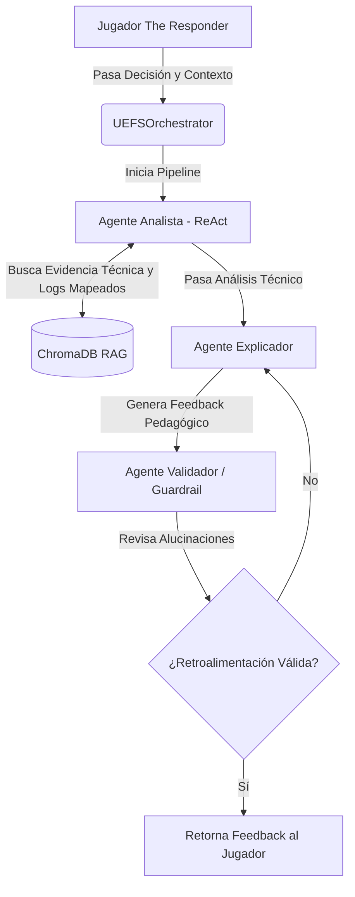

# SOC-Tutor-RAG System

Sistema multiagente de feedback pedagógico con RAG para entrenamiento en respuesta a incidentes de ciberseguridad.

## Descripción

Este sistema proporciona feedback contextualizado a jugadores del simulador SOC "The Responder", fundamentado en documentación técnica real (MITRE ATT&CK, NIST 800-61, OWASP, CISA).

## Características

- **3 agentes especializados**: Analista (ReAct), Explicador (pedagógico), Validador (verificación)
- **RAG avanzado**: Retrieval con ChromaDB y Sentence-Transformers
- **Agente Tool-Augmented**: Analista con capacidad de razonamiento ReAct y herramientas (NIST, MITRE)
- **Observabilidad**: Rastreo de latencia, tokens y costos (Traces locales)
- **Persistencia**: Memoria de sesión para seguimiento de aprendizaje
- **Seguridad**: Guardrails contra inyección y validación de Pydantic
- **Evaluación**: Dataset sintético y script de métricas de calidad

## Estructura

```
soc-tutor-rag-system/
├── src/
│   ├── agentes/        # Implementación de los 3 agentes
│   ├── orchest/        # Orquestador del sistema
│   ├── rag/            # Módulo de retrieval y vector store
│   └── utils/          # Utilidades
├── config/             # Configuraciones (LLM, paths)
├── data/
│   ├── docs/           # Documentos fuente para RAG
│   └── indices/        # Índices vectoriales
└── tests/              # Tests unitarios y de integración
```

## Uso

```python
from orchest.uefs_orchestrator import UEFSOrchestrator

orchestrator = UEFSOrchestrator()
feedback = orchestrator.generar_feedback(
    decision={"accion": "bloquear_ip", "ip": "192.168.1.100"},
    contexto={"tipo_incidente": "phishing", "fase": "contencion"}
)
```

## Arquitectura General

El sistema se basa en un flujo de orquestación (Pipeline):
1. **Entrada**: Acción del jugador (ej. "Bloquear IP").
2. **Retrieval**: El RAGClient busca evidencia en logs estáticos del juego simulado y en lineamientos oficiales.
3. **Agente Analista (ReAct)**: Usa herramientas para cruzar la decisión del jugador con la evidencia encontrada.
4. **Agente Explicador**: Convierte el análisis en feedback pedagógico.
5. **Agente Validador**: Asegura que el feedback cite manuales reales y no alucine.

### Diagrama de Flujo



## Decisiones de Arquitectura y Diseño

Para cumplir con los estándares de producción, se tomaron las siguientes decisiones de ingeniería:

1. **Stack de Retrieval (ChromaDB + SentenceTransformers)**: Se eligió ChromaDB por su facilidad de uso embebido (sin requerir servidores externos u hospedaje). Se combinó con `all-MiniLM-L6-v2` corriendo de forma estrictamente local para vectorizar la documentación y los logs; esto elimina los costos recurrentes de un proveedor de Embeddings y garantiza una alta velocidad de ingesta.
2. **Modelos (Gemini 2.5 Flash)**: Se priorizó la versión *Flash* de Gemini 2.5 dado que el patrón *ReAct* requiere de múltiples llamadas iterativas rápidas al LLM. Su relación coste/velocidad y su enorme ventana de contexto lo hacen ideal para analizar bases de conocimiento complejas sin latencias intrusivas para el jugador. Adicionalmente, el cliente (`LLMClient`) fue abstraído para soportar *Groq* y *Ollama* permitiendo ejecución 100% local si es necesario.
3. **Integración Estática de Logs (Evidencia)**: A diferencia de generar ataques de red mediante el LLM en tiempo real, se optó por ingestar los archivos JSON originales (logs pre-programados) del juego directamente a la base vectorial filtrados por la metadata del escenario. Esto anula las iteraciones "alucinadas" de evidencia técnica, reduce agresivamente los costos (se consume una vez, se evalúa millones de veces) y provee escenarios pedagógicos 100% deterministas.
4. **Orquestación Secuencial vs. Enjambre (Swarm)**: En lugar de un panel multiagente conversacional anárquico, se utilizó un flujo de tubería estricto (Recolecta -> Explica -> Valida). Esto previene loops de contexto infinitos (comunes en simuladores de agentes autónomos) y facilita agregar de manera asertiva un guardrail final (*Validador*) para controlar la calidad.
5. **Independencia de la Nube (Cloud-Free)**: Se purgó el código de servicios cloud pesados (Firebase, GCP, PubSub) para garantizar que cualquier evaluador pueda levantar el proyecto de forma local, 100% gratuita y sin fricciones técnicas complejas. Esto en preparación para los futuros despliegues híbridos orientados a no-técnicos (interfaces web puras).

## Instrucciones de Instalación (Local)

1. Clonar el repositorio.
2. Copiar el archivo de entorno y agregar tus credenciales:
   ```bash
   cp .env.example .env
   ```
3. Crear un entorno virtual e instalar las dependencias:
   ```bash
   python3 -m venv .venv
   source .venv/bin/activate
   pip install -r requirements.txt
   ```
4. Población de la Base Vectorial (Ingesta de Logs del Juego y Manuales):
   ```bash
   python scripts/ingest_game_evidence.py
   ```

## Uso y Reproducción

Para correr una demostración integrada del pipeline:
```bash
python demo_integrated.py
```

Para correr la suite de pruebas (Unitarias y de Integración):
```bash
python -m unittest discover tests/
```

## Despliegue con Docker

El proyecto está dockerizado para facilitar el despliegue.
1. Asegúrate de tener tus claves en el archivo `.env`.
2. Construye y levanta los servicios usando Docker Compose:
   ```bash
   docker-compose up --build -d
   ```
3. Para detener el sistema:
   ```bash
   docker-compose down
   ```