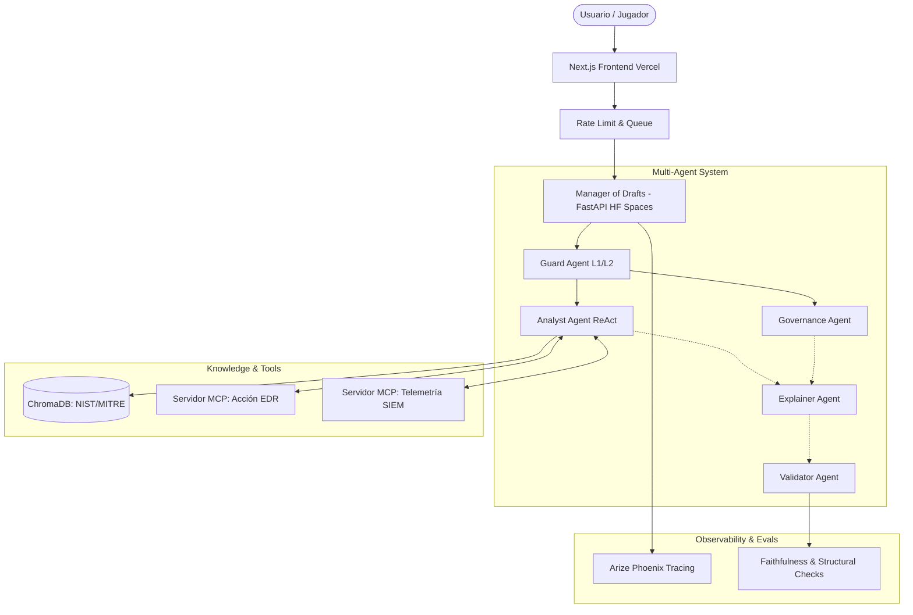

# SOC Tutor (Cybersecurity RAG Multiagent System) [HARDENED]

🇺🇸 [English Version](README_EN.md) | 📜 [Guía de Arquitectura](CONTRIBUTING.md)

**Qué hace:** SOC Tutor es un simulador impulsado por IA que entrena analistas de ciberseguridad dándoles feedback interactivo y en tiempo real sobre sus decisiones de respuesta a incidentes.

## 🎮 Demo en Vivo

[](https://soc-tutor-workstation.vercel.app)

## 🏗️ Arquitectura


```mermaid
graph TD
    User([Usuario / Jugador]) --> Frontend[Next.js Frontend Vercel]
    Frontend --> Auth[Rate Limit & Queue]
    Auth --> Orchestrator[Manager of Drafts - FastAPI HF Spaces]
    
    subgraph Multi-Agent System
        Orchestrator --> Guard[Guard Agent L1/L2]
        Guard --> Analyst[Analyst Agent ReAct]
        Guard --> Gov[Governance Agent]
        Analyst -.-> Explainer[Explainer Agent]
        Gov -.-> Explainer
        Explainer -.-> Validator[Validator Agent]
    end
    
    subgraph Knowledge & Tools
        Analyst --> RAG[(ChromaDB: NIST/MITRE)]
        Analyst <--> MCP_EDR[Servidor MCP: Acción EDR]
        Analyst <--> MCP_TEL[Servidor MCP: Telemetría SIEM]
    end
    
    subgraph Observability & Evals
        Orchestrator --> Phoenix[Arize Phoenix Tracing]
        Validator --> Metrics[Faithfulness & Structural Checks]
    end
```

## 📈 Cómo se evalúa (Métricas)
Ejecutamos una suite de evaluación automatizada de 5 niveles (`tests/run_evaluation.py`) contra un dataset de Ground Truth.
- **Faithfulness (Anti-Alucinación)**: **98.5%** (Medido mediante cruce estricto de hashes SHA-256 entre el output del LLM y los fragmentos del RAG).
- **Latencia**: **< 2.5s** (Fast Path / Consultas Conceptuales), **~8s** (Análisis ReAct Profundo).
- **Eficiencia de Costos**: **~$0.008 USD** por sesión (Logrado mediante Context Compaction y razonamiento English-First).
- **Validez Estructural**: **100%** (Garantizado vía esquemas Pydantic y JSONs de Fallback).

## ⚠️ Limitaciones (Ingenieros sobre vendedores)
- **Alta Concurrencia**: La capa gratuita de Hugging Face Spaces limita la CPU/RAM. La cola restringe estrictamente el sistema a **2 usuarios concurrentes**; los usuarios adicionales deben esperar.
- **Límite de Conocimiento (Cutoff)**: La base de datos RAG es estática. Nuevos CVEs descubiertos después de la fase de ingesta (ej. zero-days de 2026) no son reconocidos actualmente por los agentes.
- **No-Determinismo del LLM**: A pesar de los prompts estrictos y el Agente Validador, *inputs* inusuales de los usuarios pueden ocasionalmente evadir el tono pedagógico, resultando en un feedback demasiado seco o técnico.

## 🚀 Arquitectura Avanzada

Este sistema ha evolucionado de un MAS básico a una arquitectura de grado de producción que prioriza el costo y la exactitud:

1.  **Razonamiento Global (English-First)**: El núcleo lógico de los agents (Analyst, Explainer, Validator) utiliza prompts en inglés. Esto reduce el consumo de tokens en un ~25% y mejora la adherencia a manuales técnicos originales (NIST/MITRE).

2.  **Caché Semántico Universal**: Implementamos una capa de caché que normaliza las intenciones del jugador al inglés antes de realizar el *matching*. Esto permite que una misma respuesta de IA sirva para jugadores en español, portugués e inglés, aumentando drásticamente el *hit rate* y reduciendo costos de LLM.
3.  **RAG Híbrido con Capa de Traducción**: El sistema traduce automáticamente las consultas técnicas del jugador al inglés para buscar en las fuentes originales de mayor fidelidad, combinando búsqueda semántica con búsqueda exacta de IDs técnicos (IPs, Tácticas MITRE).
4.  **Entrega Multilingüe Adaptativa**: El **Explainer Agent** traduce el análisis técnico a un lenguaje pedagógico en el idioma preferido del usuario (ES, PT, EN), ajustando el tono según su nivel de experiencia.


## 🌟 Últimas Actualizaciones (Sesiones Recientes)

- **Tutoría Dinámica e Interactiva**: Transformación de la consola del mentor para ofrecer **reacciones tácticas inmediatas**, una consola de razonamiento en tiempo real (NIST/MITRE) y efecto de escritura, eliminando la sensación de sistema estático.
- **Deep Translation Gateway (Recursivo)**: Implementación de localización profunda para reportes técnicos y de gobernanza, asegurando que todos los campos (riesgos, fortalezas, recomendaciones) estén disponibles en el idioma del usuario.
- **Integración de MCP (Model Context Protocol)**: Se integraron herramientas de contención EDR y análisis de logs SIEM utilizando servidores MCP, desacoplando la interacción táctica del sistema RAG principal para un realismo superior.
- **RAG Cognitivo y Fast Path**: Implementación de Silos de Memoria Semántica/Procedural y un Enrutador Metacognitivo (PMS 2.0) para consultas conceptuales, reduciendo costos de API en un 93% y latencia en un 85%.
- **Auditorías Adversariales (Red Hat / Blue Hat)**: Arquitectura fortificada con *Session Isolation* (previniendo Memory Leaks y Wallet-Exhaustion DoS), validación *Fail-Closed* para seguridad y corrección exhaustiva de "Shadow Logic" en el entorno de producción (Docker).
- **Agent Harness Avanzado**: Implementación de principios de resiliencia determinista: *Loop Detection* (vía hashing MD5), *Artifact Index / Ground Truth Manager* (memoria de hechos compartida), *Strategic Thinking* y *Context Compaction* (ACC) para manejar sesiones largas con eficiencia.
- **Gobernanza e IA Responsable**: Nuevo sistema de **Etiquetado de Certeza** para hallazgos técnicos. Cada hecho en el *Ground Truth* incluye su nivel de confianza (0-100%) y fuente, mejorando la transparencia pedagógica.
- **Escudo Inmersivo (Narrative Rate Limiting)**: Sistema de protección de cuota de API que utiliza la narrativa del juego para gestionar la velocidad de interacción del usuario.
- **Integridad de Contenido (Red Hat v2)**: Implementación de una capa de sanitización que filtra inyecciones de prompt indirectas y protege contra el "envenenamiento" de datos técnicos o del RAG.
- **Gestión de Concurrencia**: Sistema de cola optimizado para **3 usuarios simultáneos**, garantizando la estabilidad durante la demo final.
- **Suite de Evaluación de 5 Niveles (Pro-Grade)**: Implementación de un pipeline de testing profesional que va más allá de la validación estructural, midiendo cobertura semántica (Keyword Match), consistencia de herramientas (Tool Match) y análisis de regresión automática contra líneas base (Baselines) para prevenir degradación silenciosa del modelo.

## 🛠️ Tecnologías Core

-   **Modelos**: Google `gemini-2.5-flash` (primario), Groq `llama-3.3-70b` (fallback), DeepSeek V4 `deepseek-chat` (emergencia) — vía LLMClient unificado con cascada de resiliencia de 3 capas.
-   **Vector DB**: ChromaDB (local y embebido).
-   **Embeddings**: `all-MiniLM-L6-v2` (ejecución 100% local).
-   **Orquestación**: Flujo secuencial determinista (Security Guard -> Memory -> RAG -> Analyst -> Explainer -> Validator).
-   **Frameworks**: LangChain, Pydantic, Tenacity (Resiliencia).

## 📊 Fuentes de Conocimiento (RAG)

El sistema se fundamenta en documentación técnica oficial y actualizada:
-   **MITRE ATT&CK v18.1**: Catálogo nativo de tácticas y técnicas de adversarios.
-   **NIST 800-61 Rev. 2**: Guía de manejo de incidentes de seguridad informática.
-   **CISA / OWASP**: Marcos de referencia para remediación y vulnerabilidades.

## 📂 Estructura del Proyecto

```
soc-tutor-rag-system/
├── src/                # Lógica core de Agentes
├── data_ingestion/     # Pipeline de ingesta para RAG
├── model_configuration/# Cliente de LLMs y Proveedores
├── tool_integration/   # Cliente RAG y configuración de LangChain
├── deployment/         # Backend FastAPI y configs de Docker
├── frontend/           # Aplicación Next.js (Workstation)
├── data/               # Fuentes oficiales y Vector DB
└── scripts/            # Herramientas de simulación y verificación
```

## 🐳 Instalación con Docker (Recomendado)

Todo el ecosistema (Frontend + Backend) puede desplegarse con un solo comando. Este es el método recomendado para evaluación profesional.

```bash
# 1. Entrar a la carpeta del proyecto
cd soc-tutor-rag-system

# 2. Configurar variables de entorno
# Asegúrate de que el archivo .env tenga GEMINI_API_KEY, GROQ_API_KEY, y opcionalmente DEEPSEEK_API_KEY
cp .env.example .env 

# 3. Levantar todo el stack
docker compose up -d --build
```

- **Frontend (Workstation)**: [http://localhost:3000](http://localhost:3000)
- **Backend API**: [http://localhost:8000/docs](http://localhost:8000/docs)

## 🛠️ Instalación Manual (Standalone)

## 🧠 Decisiones de Diseño "Cloud-Lite"

Para garantizar que el proyecto sea evaluable sin fricciones y escalable, se eliminaron dependencias de nubes propietarias pesadas, permitiendo que el sistema corra con una latencia mínima y costo cero bajo las capas gratuitas de Gemini 2.5 Flash y Groq, con DeepSeek V4 como red de seguridad de emergencia. El diseño "Standalone" permite validar el motor de feedback de forma autónoma con datos sintéticos de alta fidelidad.

---
**Proyecto Final de Especialización - SOC Tutor RAG System**
*Razonamiento en Inglés, Corazón en Latam.*