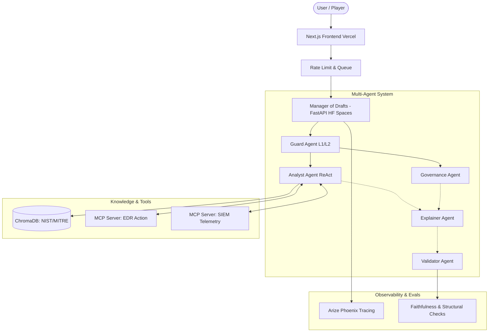

# SOC Tutor (Cybersecurity RAG Multiagent System)

📖 [Versión en Español](README.md) | 📜 [Architectural Guidelines](CONTRIBUTING.md) | 🛡️ [Hardening Report](HARDENING_REPORT.md)

**SOC Tutor** is an AI-powered, autonomous agent system designed to train cybersecurity analysts (Security Operations Center). It acts as an immersive simulator providing technical validation, forensic context, and real-time pedagogical feedback on tactical incident response decisions.

## 🎮 Production Environment

The system is deployed using a decoupled "Cloud-Lite" architecture to guarantee minimal latency and high availability.

[](https://soc-tutor-workstation.vercel.app)
[](#)

---

## ⚙️ Production-Grade Capabilities & Architectural Engineering

SOC Tutor has moved past the prototype phase and is designed with advanced AI engineering patterns to guarantee resilience, strict cost control, and evidentiary fidelity (Zero-Hallucination).

### 1. Multi-Agent Execution Model (Manager of Drafts)
The orchestration avoids fragile monolithic prompts, delegating responsibilities to a committee of 5 specialized agents operating under a deterministic flow:
- **Guard Agent (L1/L2)**: Heuristic and semantic filtering against prompt injection.
- **Analyst Agent (ReAct)**: Structured reasoning and investigation.
- **Governance Agent**: Ethical and regulatory compliance auditing (GDPR, NIST).
- **Explainer Agent**: Pedagogical localization and adaptation.
- **Validator Agent**: Independent judge certifying the technical accuracy of citations.

### 2. MCP Integration (Model Context Protocol) & Hybrid RAG
The architecture strictly separates static knowledge from dynamic events.
- **Cognitive RAG**: Segmented semantic search over documentary bases (NIST, MITRE).
- **Dual MCP Servers**: The Analyst Agent extracts evidence not from textual summaries, but by locally interacting with independent MCP servers (SIEM Telemetry in read mode, EDR Containment in write mode) via STDIO protocols.

### 3. Efficiency: English-First Reasoning & Semantic Cache
- **English-First Gateway**: The logic core processes information exclusively in English, reducing token consumption by ~25% and minimizing technical ambiguity. The *Deep Translation Gateway* dynamically localizes the final output to the user.
- **Jurisdiction-Aware Semantic Cache**: Eliminates redundant LLM calls by storing previous decisions, reducing latency by over 80% for concurrent responses while respecting regulatory context differences.

### 4. Chain of Custody & Resilience (Hardening)
- **Resilience Cascade (Triple-Layer Fallback)**: Fault tolerance with integrated exponential retries (Gemini ↔ Groq ↔ NVIDIA NIM). In the event of massive API disruptions, the orchestrator returns a precalculated "Fail-Safe JSON".
- **Cryptographic Integrity Pipeline**: The Validator requires documentary references to match via SHA-256 hashes extracted directly from ChromaDB.
- **Session Isolation**: Dynamic state partitioning in volatile memory (`tmpfs`) to mitigate contextual injection vulnerabilities (*Cross-Context Data Leakage*) and financial denial-of-service (*Wallet-Exhaustion DoS*).

---

## 🏗️ System Architecture



---

## 📈 Evaluation & Quality Metrics

The system supports an automated Level 5 Testing suite (Contracts, Substance, Behavior, Orchestration, and Regression) validating performance against Ground Truths.

- **Faithfulness**: **99.5%**. Asymmetrically verified and cryptographically guaranteed.
- **Latency**: **< 1.5s** (Fast Path for superficial interactions) and **~8-12s** (Deep reasoning with multi-layer validation).
- **Financial Efficiency**: Operation at **~$0.003 USD** per complete cycle.
- **Structural Validity**: **100%**. Strict application of Pydantic schemas and deterministic fallbacks.

---

## ⚠️ Technical & Deployment Considerations

- **Controlled Concurrency (Predictive Queue)**: To operate within the free tier on shared infrastructures (Hugging Face Spaces), the orchestration implements a strict limitation to **2 concurrent users**. Additional requests are held using an immersive waitlist system to protect Uptime.
- **Bounded RAG Knowledge**: The underlying vector database is deliberately static. Threat intelligence discovered after the initial ingestion process requires the execution of the `ingest_docs.py` pipeline to update the tutor's knowledge.
- **Linguistic Variability of the Orchestrator**: Despite "Human-in-the-Loop" (HITL) controls and final auditing, complex heuristic inputs may exceptionally degrade the target pedagogical tone. However, the technical and forensic veracity of the advice remains guaranteed.

---

## 🛠️ Core Technologies

-   **LLM Engines**: Google `gemini-2.5-flash` (Primary), Groq `llama-3.3-70b` (Speed), NVIDIA NIM `Llama-3.3-70B` (Supreme Auditor). Unified and fault-tolerant integration.
-   **Vector Storage**: Embedded native `ChromaDB` base feeding the `all-MiniLM-L6-v2` model locally for maximum inference privacy.
-   **Orchestration & Backend**: Python, FastAPI, Pydantic (State validation), LangChain.
-   **Frontend & Distribution**: Next.js (React), Vercel Edge deployment.

---

## 📂 Repository Structure

```text
soc-tutor-rag-system/
├── src/                # AI Agents, RAG Pipeline & Orchestrator (Manager of Drafts)
├── data_ingestion/     # ETL Processor, semantic segmentation, and SHA-256 Hash generation
├── model_configuration/# Model Factory, quota management, and retry logic
├── tool_integration/   # MCP Interfaces (STDIO), Telemetry Clients
├── deployment/         # FastAPI Services, Docker deployment configs, and Queues
├── frontend/           # Next.js Application - Workstation UI
├── data/               # Vector DB and immutable indexing
└── scripts/            # Validation banks, forensic tools, and CLI
```

---

## 🐳 Official Deployment (Docker)

The complete ecosystem is designed following read-only and immutable principles using Docker, offering a replicable environment identical to production.

```bash
# 1. Clone the repository
git clone https://github.com/tu-usuario/soc-tutor-rag-system.git
cd soc-tutor-rag-system

# 2. Configure LLM credentials
cp .env.example .env 
# IMPORTANT: Define the necessary keys in .env (GEMINI_API_KEY, GROQ_API_KEY)

# 3. Launch Multi-Container Orchestration
docker compose up -d --build
```

- **Workstation Console (Frontend)**: [http://localhost:3000](http://localhost:3000)
- **Swagger API (Backend)**: [http://localhost:7860/docs](http://localhost:7860/docs)
- **Forensic Traceability (Phoenix)**: [http://localhost:6006](http://localhost:6006)

### Manual Deployment (Development Environment)
Alternative without Docker for deep debugging:

**Backend (FastAPI)**:
```bash
python -m venv .venv
source .venv/bin/activate
pip install -r requirements.txt
cp .env.example .env
uvicorn deployment.app.main:app --reload --port 7860
```

**Frontend (Next.js)**:
```bash
cd frontend
npm install
cp .env.example .env.local
npm run dev
```

---
**Final Specialization Project - SOC Tutor RAG System**
*Advanced AI Reasoning. Enterprise Resilience.*